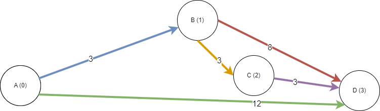
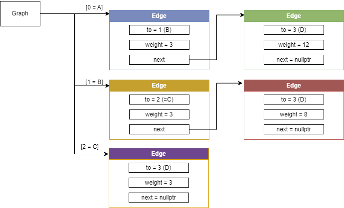
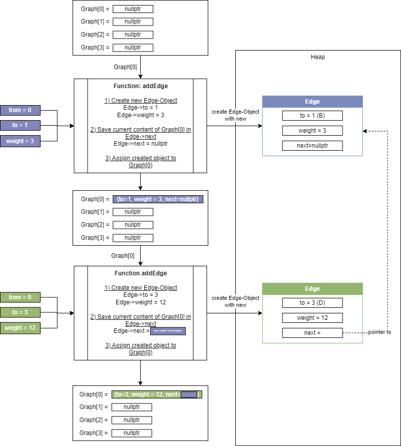

# Graph algorithms
## Summary
**Description :** 
This code shows a graph representation in a class Graph.
The graph is stored as adjaceny list.
Follwoing graph algorithms are implemented:

- Dijkstra

**Time Complexity :** O(VE) *(where V is number of vertices & E is number of edges)*

---

	A massive collaborative effort by <a href="https://github.com/OpenGenus/cosmos">OpenGenus Foundation</a> 

---

## Detailed description

### Example Graph
The figure "Example graph" shows an example graph with the nodes A, B, C, and D connected by weighted edges.
In the implementation, the nodes are represented by whole numbers from 0 to 3.
This example graph is used to introduce an adjacency list and to explain different algorithms.

### Adjacency list

### Dijskra
